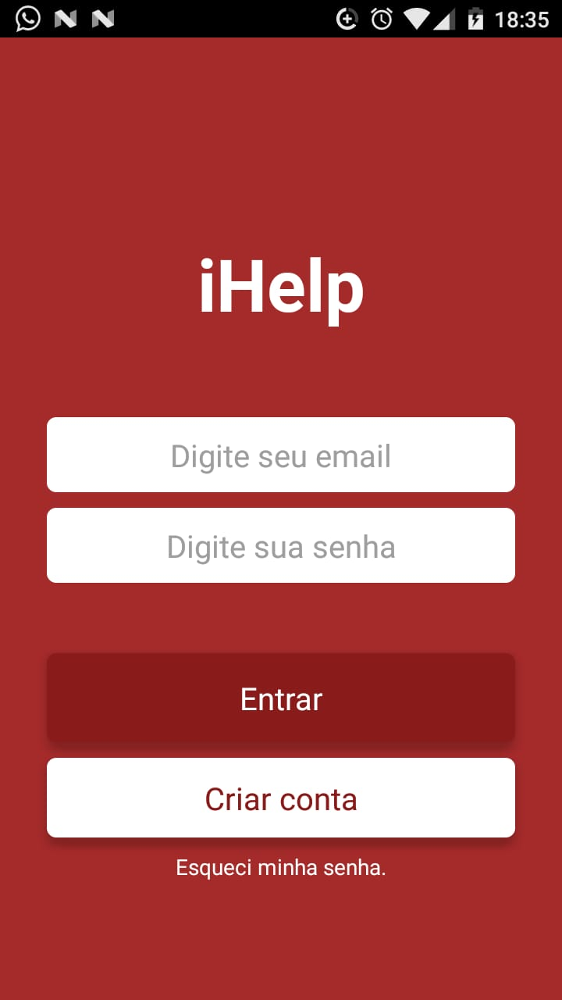
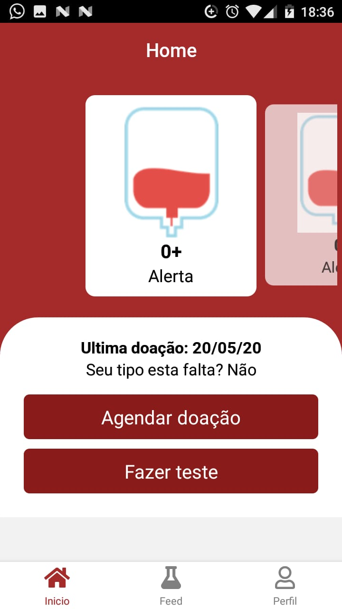
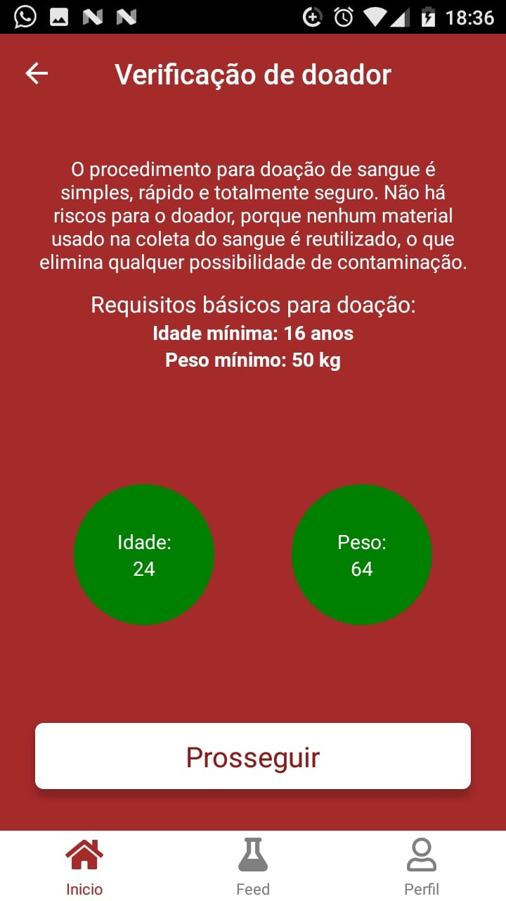
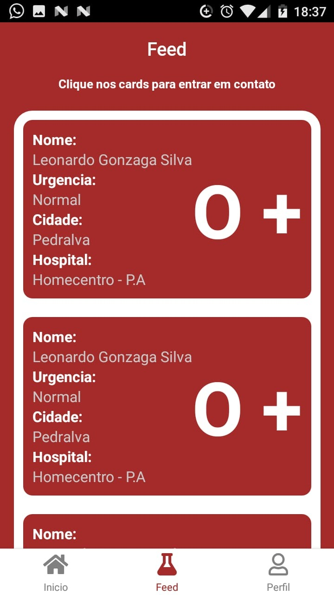

# iHelp App

# Objetivo
Esse aplicativo foi desenvolvido com um intuito de facilitar o encontro de doadores de sangue na região de MG. Inicialmente esta limitado a MG pois usamos os dados do nivel de sangue encontrados no site do hemocentro.

# Instalação
- Primeiro passo, basta clonar o repositório. `git clone  https://github.com/LeoGonzaga/ihelp.git`
- Em seguida, acesse a pasta do projeto e execute `yarn` para instalar todas as dependências
- Após todos os downloads serem concluidos, inicie o emulador e execute `yarn react-native run-android`

# Funcionalidades
- Cadastro de usuário
- Edição de perfil de usário
- Recuperação de senha por email
- Autenticação por token jwt

- Criação de um pedido de doação
- Feed com todos os pedidos cadastrados
- Possibilidade de entrar em contato com o requerinte apenas clicando no card
- Instruções básicas para doação

# Layout

  
   
   
   

